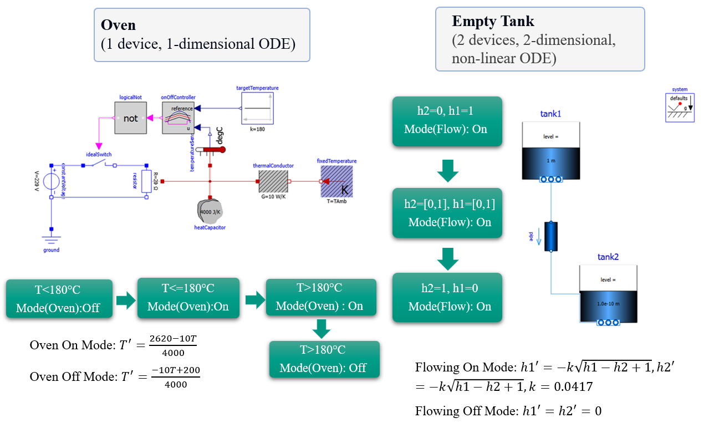
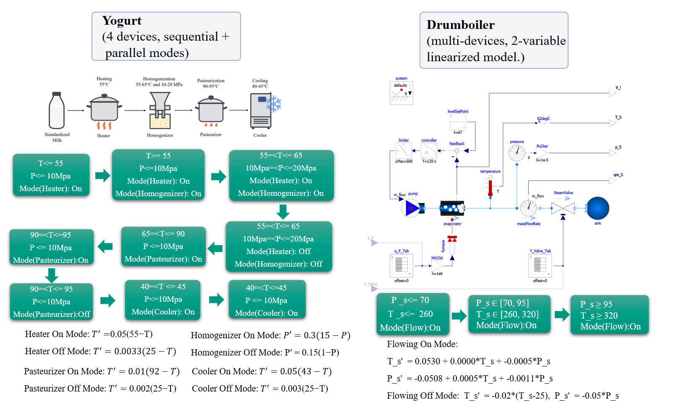

# RDFdL: Integrating RDF with Differential Dynamic Logic

This repository implements the RDFdL verification pipeline that connects RDF/SHACL modelling with differential dynamic logic (dL) proofs to validate Cyber-Physical Systems (CPS).

## 1. Pipeline at a glance
1. **Model with RDF/SHACL**: Describe CPS components, states, and constraints.
2. **Reason with Jena**: Infer candidate transitions (e.g., `next`, `ModeChange`) from the validated graph.
3. **Prove with KeYmaera X**: Generate dL obligations for each transition and send them to KeYmaera X.
4. **Verified graph**: Only transitions proven by KeYmaera X are kept, yielding a verified state graph.

## 2. Modules overview
- `Yogurt_example/`: Multi-stage yogurt process (heater, homogenizer, pasteurizer, cooler) with multi-mode transitions.
- `Oven_cake/`: Industrial oven temperature control across four states and two modes.
- `emptytank2/`: Two-tank continuous system with nonlinear ODEs.
- `drumboiler/`: End-to-end FMU → RDF/SHACL → dL obligation pipeline for the Modelica DrumBoiler model.

## 3. Running each example

### DrumBoiler visuals

### Yogurt
- Test entry point: `Yogurt_example/src/test/java/IsNextBuiltinTest.java`
- Command: `mvn test -pl Yogurt_example -Dtest=IsNextBuiltinTest`
- Output: TTL files with inferred relations (raw and post-processed).

### Oven
- Test entry point: `Oven_cake/src/test/java/IsNextBuiltinTest.java`
- Command: `mvn test -pl Oven_cake -Dtest=IsNextBuiltinTest`
- Output: `knowledgeGraphWithSHACL_oven_safe_processed.ttl` with the final graph.

### Empty Tank
- Test entry point: `emptytank2/src/test/java/IsNextBuiltinTest.java`
- Command: `mvn test -pl emptytank2 -Dtest=IsNextBuiltinTest`
- Output: `knowledgeGraphWithSHACL_Tank1_IsNext_Test.ttl` with the final graph.

### DrumBoiler
- Build: `cd drumboiler && mvn clean package`
- Run (generation only):  
  `java -jar target/drumboiler-0.1.0-SNAPSHOT.jar --fmu fmu/DrumBoiler.fmu --config config/drumboiler_config.json --output build`
- Run with verification (KeYmaera X server at http://localhost:8090):  
  `java -jar target/drumboiler-0.1.0-SNAPSHOT-jar-with-dependencies.jar --fmu fmu/DrumBoiler.fmu --config config/drumboiler_config.json --output build --verify true`
- Outputs in `build/`: SHACL, dL obligations (`.kyx`), and a verification summary.

## 4. Quick start
- **Java** 11+ (parent project targets 23), **Maven** 3.6+, **KeYmaera X** 5.0.1, **Wolfram Engine** 13.1 (for KeYmaera X ODE solving).
- From repo root: `mvn clean install`
- Then run the module-specific commands above as needed.
