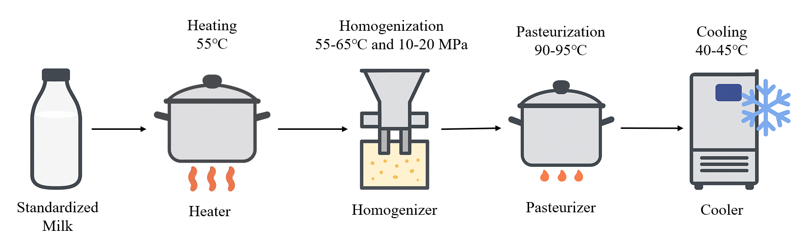

# Yogurt_example

# Yogurt Process




# Jena State Reasoner
This project uses Apache Jena to implement four reasoning rules demonstrated with a yogurt manufacturing example. The main Java classes are:

- `IsNextBuiltin.java`
- `ModeChange.java`
- `ModeChange2.java`
- `ModeChange3.java`
- `ModeChange4.java`

- Auxiliary classes: `RDFPostProcessor.java`, `Prove_helper.java`
- `Prove_helper.java` Sends a request to KeymaeraX, fetches and interprets the result
- `RDFPostProcessor.java` Converting generic state relationships (next, ModeChange, ModeChange2,ModeChange3, ModeChange4) into more specific descriptive relationships.

The test and validation classes are located in the `test` directory:
- `IsNextBuiltinTest.java`: Runs the five reasoning rules.

Any RDF generated by the reasoning process is saved in the `resources` folder (e.g., `test/resources/`).
There are 2 '.ttl' files in the resources folder: 
- `knowledgeGraphWithSHACL_original2.ttl` is the output RDF without changing the relationships' names with `RDFPostProcessor.java`
- `knowledgeGraphWithSHACL_processed2.ttl` is the final output RDF file.

### Sparql Query
Please Check `src/main/resources/Sparql_Query_Yogurt.pdf` Folder, all the SPARQL Queries are updated in this folder.

### Prerequisites

- **Java:** Version 11 or higher
- **Build Tool:** Apache Maven

### Dependencies

- **KeyMaeraX:** Download from [KeyMaera X](https://keymaerax.org/) (Version 5.0.1, provided as a .jar file)
- **Wolfram Engine:** Download from [Wolfram Engine](https://www.wolfram.com/engine/) (Version 13.1 was used; the Community Edition is free)

Follow the [KeyMaeraX setup instructions](https://keymaerax.org/documentation.html#setup) to integrate the Wolfram Engine with KeyMaeraX.

After installing the prerequisites and dependencies, run the following command to install all external packages:

```bash
mvn install
